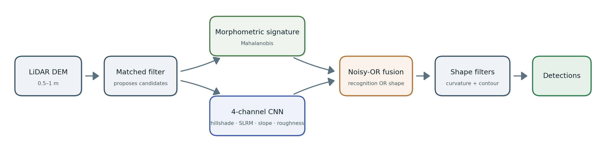

# tumulus-lidar-detector

Detection of plain-field burial mounds (kurgans) in 0.5–1 m LiDAR. A small CNN (~23k parameters)
learns dome shape from 21,565 Danish mounds and is fine-tuned with Romanian ones (cross-country
morphology transfer). A matched filter proposes candidates; the CNN and a morphometric shape
signature are fused noisy-OR into a single score; shape filters cut the mimics. Designed for mounds
of ~20–40 m diameter. Built for prospection — confirmation remains field survey.

**[STUDY.md](STUDY.md)** — method, blind evaluation, cross-country transfer, limitations.

[](https://colab.research.google.com/github/ObuObuHub/tumulus-lidar-detector/blob/main/demo.ipynb)
**Run it in your browser, no install**: Runtime → Run all, pick a point on the map (0.5 m coverage:
Oltenia / south-west Romania) and scan.



## Quick start

```
pip install -r requirements.txt
python tools/tumul_scan.py 23.36 23.48 43.86 43.97 candidates.csv
```

Scans a lon/lat box on Romania's 0.5 m LiDAR (ANCPI tiles are downloaded on demand) and writes
ranked candidates (lon, lat, fused score, per-signal columns). Defaults reproduce the study;
thresholds and filters are tunable via environment variables documented in `tools/tumul_scan.py`.

## Results

| Benchmark | Result |
|---|---|
| Catane, ~57 km², blind, real prevalence (22 real mounds) | AUPRC 0.66, recall 91%; 21/22 at the production operating point |
| County-scale deployment (Dolj) | 635 mounds confirmed by expert form review out of 1,198 candidates; ~97% absent from official catalogues |
| Foreign kurgans, Poland, 1 m | AUROC 0.71; ~48% recall on kurgans with a preserved mound |

Details, caveats and negative results: [STUDY.md](STUDY.md).

## Verify with your own ground truth

```
python tools/benchmark.py your_gt.csv combined_cnn.pt
```

Downloads the tiles and reports AUPRC / recall / false positives at real prevalence against a
ground-truth CSV that you supply.

## Repository layout

- `tools/tumul_scan.py` — production scanner (matched filter → CNN + shape signature → noisy-OR fusion → mimic filters)
- `tools/scan_zone_v4.py` — the engine behind the Colab demo (same chain)
- `tools/lib_tumul.py`, `tools/lib_channels.py` — shared library (footprint, channels)
- `tools/benchmark.py` — blind benchmark at real prevalence, user-supplied ground truth
- `assets/` — fusion formula, mimic-filter models, morphometric fingerprint, demo map, figures
- `combined_cnn.pt`, `multichannel_cnn.pt` — trained weights

## Ethics

Coordinates of detected mounds are withheld to avoid facilitating looting; this repository ships the
model and the method, not site locations.

## Data & credits

- **DTM:** ANCPI, *LAKI II / LAKI III* national LiDAR (Romania). Test LiDAR: Environment Agency (UK), PDOK AHN (NL), GUGiK (PL).
- **Training positives:** Denmark *Fund og Fortidsminder* (Rundhøj, registry-public) + Romanian field-confirmed mounds.
- Author: **Chiper-Leferman Andrei** (ObuObuHub).

Special thanks to **Dr. Alexandru Hegyi** and **Dr. Mehdi Nourelahi** for their guidance and advice.

## License

- **Code** (`tools/`): **MIT**, see [LICENSE](LICENSE).
- **Model weights, docs & figures:** **CC-BY-4.0** — free to use, share and adapt, including
  commercially, with attribution to Chiper-Leferman Andrei.
