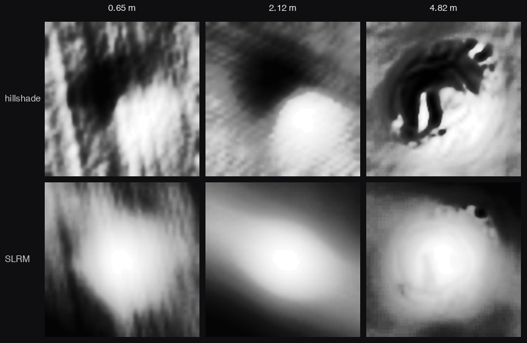
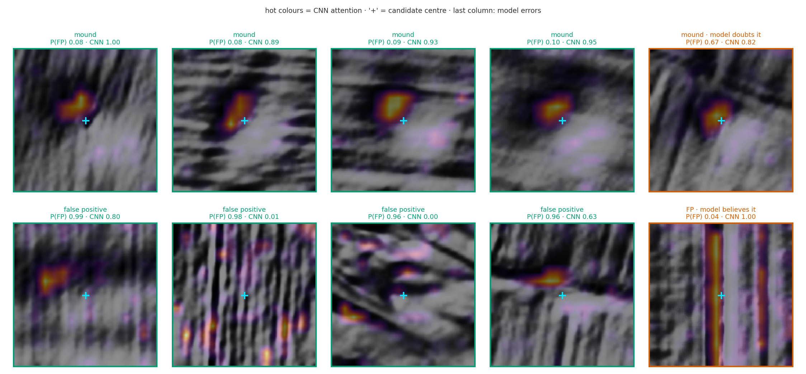
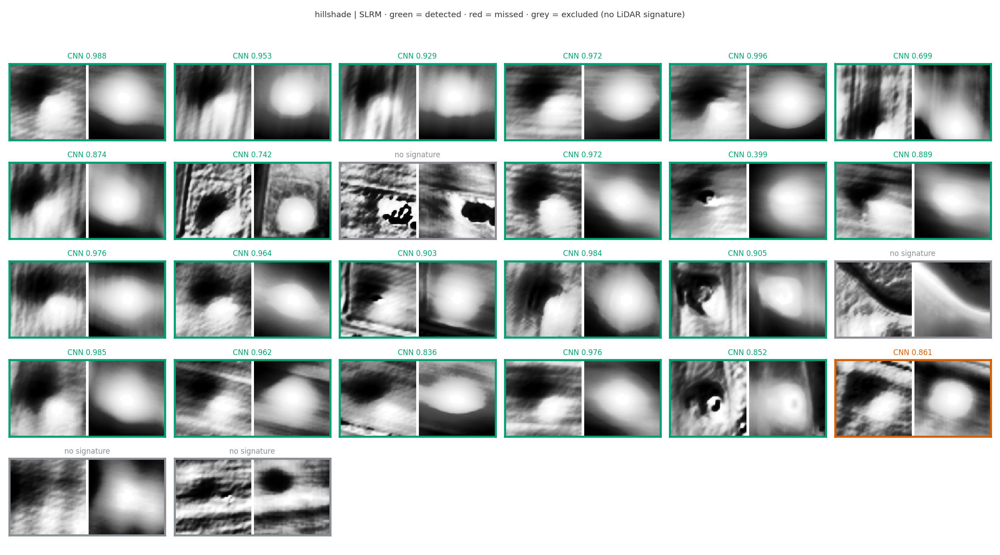
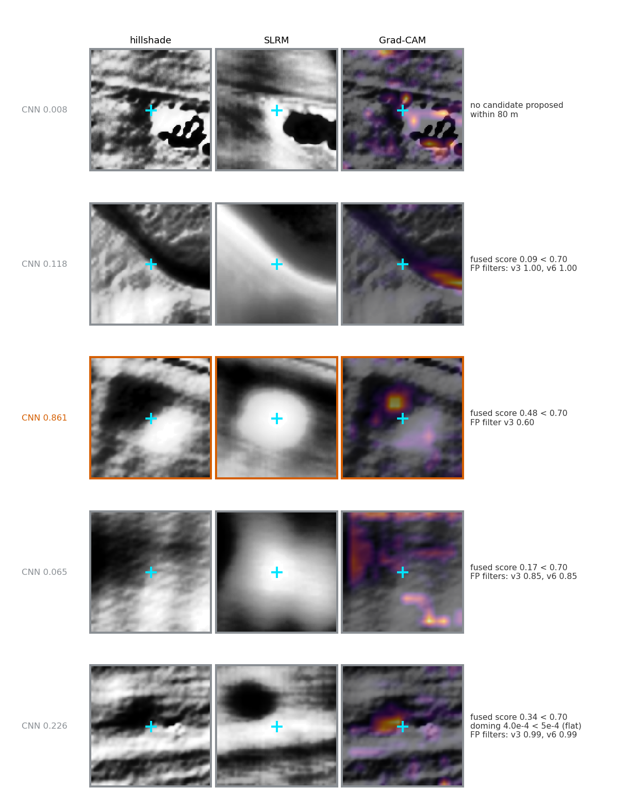
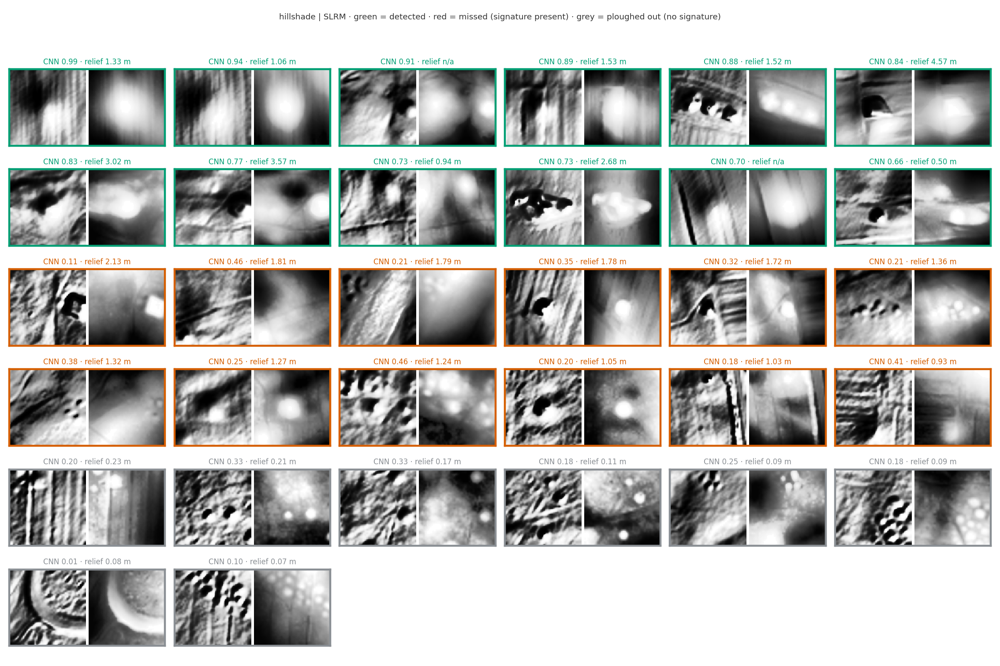

# Detecting plain-field burial mounds in LiDAR via cross-country morphology transfer

Andrei Chiper-Leferman

## Abstract

We present a detector of burial mounds (kurgans) in LiDAR for the plains of Romania, where centuries
of ploughing have flattened many mounds and official catalogues are incomplete. The central data idea
is **morphology transfer**: the network learns dome shape from 21,565 well-preserved Danish mounds,
while the counter-examples come from Romanian terrain. The core is a small CNN (~23,000 parameters),
embedded in a chain that fuses visual recognition with morphometry and with curvature filters. On the
blind benchmark it recovers 91% of the real mounds, and the shape recognition transfers to foreign
plain kurgans. Its role is prospection on 0.5 m LiDAR; confirmation remains field survey.

## 1. Problem

Kurgans are round mounds on open terrain. Ploughing has often brought them below 1 m in height at tens
of meters in diameter, so the target includes scarified mounds, not only clear domes. Official
catalogues are incomplete and poorly georeferenced, so they cannot serve as a precision reference.
Automated mound detection in LiDAR already has a consistent literature — geomorphometry, marked point
processes and convolutional networks (including on kurgans).

## 2. Data and cross-country transfer

Visible Romanian positives are few. The solution: borrow the shape where mounds survive by the
thousands, and take the negatives from the working terrain.

- **Positives:** 21,565 Danish mounds (Rundhøj, 0.4 m) plus 157 Romanian mounds (west: the Arad and
  Timiș area; south: Oltenia), integrated to fine-tune the model to Romanian terrain.
- **Negatives (~52,000):** mostly Romanian (plain, hills, villages, ploughland, dikes), plus mimics
  harvested from the model's own real false positives.

Each source contributes both positives and negatives, so source identity cannot become a shortcut.
The Danish-to-Romanian transfer is confirmed empirically. Declared risk: the class imbalance
(21.5k vs 157) is the biggest danger for Romanian specificity.

## 3. Model

A small CNN (~23k parameters), 128×128 px input windows covering 80 m of terrain at 2 m effective
resolution (multidirectional hillshade):

```
Conv2d(→16,3×3,s2)→ReLU → Conv2d(→32)→ReLU → Conv2d(→64)→ReLU → AdaptiveAvgPool → Linear(64→1)
```

Small by design: a large network would memorize the source, not the shape. By construction, the
positive class is dome symmetry, not prominence, so it also fires on scarified mounds.


The production chain (Figure 1): a matched filter proposes candidates; two independent lines of
evidence — the morphometric signature (Mahalanobis distance on shape descriptors) and the 4-channel
CNN (hillshade, SLRM, slope, roughness) — are fused noisy-OR into one score with one threshold
(a candidate passes if it *looks like* OR *has the geometry of* a mound; the fusion has AUROC 0.92
in cross-validation on the fitting set, not blind); curvature and contour filters then cut the mimics.

## 4. Detection on flattened mounds



**Figure 2.** Three confirmed mounds (0.65 / 2.12 / 4.82 m): the diameter is conserved (~32 m) even
when the height nearly vanishes, so the detector works on shape, not amplitude.

## 5. Discriminating mimics

Mimics (natural undulations, spoil heaps, dikes, ploughland) match the mound both in shape and in
setting. Two choices address them: the recognition + morphometry fusion (each catches what the other
misses), and curvature as a filter after the network (Grad-CAM showed the network confuses linear
banks with domes; curvature was noise inside the network, but signal as a filter).

Measured on 541 mimics / 635 mounds: no single signal dominates, but combined they give AUC 0.94
(0.85 on a held-out set); the strongest are contour linearity and circularity. The inspiration came
from the ABCD criteria of dermatoscopy. Curvature as a fifth input channel helps in other work; here
it was noise, so we use it as a filter, not as an input.



## 6. Evaluation

Blind Catane benchmark: full scan at real prevalence. We excluded 4 labels with no LiDAR signature
(flattened or mispositioned mounds), leaving 22 real mounds. On ~57 km², same area for both:

| Model | AUPRC | recall |
|---|---|---|
| Production chain (4 channels + fusion + filters) | **0.66** | **91%** |
| Single-channel core | 0.68 | 82% (73% at threshold 0.7) |

Equal AUPRC; the 4-channel chain holds recall much better (indicative comparison — different score
substrates). At the production operating point (fused score ≥ 0.70 plus filters), 21 of the 22 real
mounds are detected (Figure 4).



**Figure 4.** The 22 real mounds at the production operating point: 21 detected (green) and one faint
real mound missed (red). The 4 labels with no LiDAR signature are excluded from the benchmark (grey).



**Figure 4b.** Grad-CAM on the 4 excluded no-signature labels and on the one faint real mound missed,
with the reason for each cut.

## 7. Generalization to foreign mounds

The production CNN on independent foreign mounds, public LiDAR (AUROC, mound vs control):

| Set | Morphology | Resolution | AUROC | recall |
|---|---|---|---|---|
| UK, Salisbury Plain | ditch-ring barrows | 1 m | 0.644 | 17% |
| NL, Veluwe/Drenthe | domes under forest | 0.5 m | 0.617 | 14% |
| **PL, kurgans** | **domes on open fields** | 1 m | **0.709** | **27%** |

Morphology matters: the more a foreign mound resembles a plain kurgan, the better the transfer;
clear kurgans score like home mounds (0.89–0.99). The raw recall in the table (27%) is against the
full OSM catalogue; about 38% of those points no longer have a LiDAR signature (ploughed-out
kurgans), and on kurgans with a visible mound recall rises to ~48% (58% on the well-preserved ones).
The model specializes in plain-field domes and transfers recognition to kurgans of the same type;
other morphologies require local data.



**Figure 5.** Green = detected; red = missed despite a LiDAR signature (a real failure); grey = no
signature (ploughed-out kurgan). CNN = recognition score; relief = the signature at the point.

## 8. Limitations

- Very small mounds (<~15 m) are under-detected; precision collapses at ≥2–5 m resolution.
- Near-perfect mimics remain false positives; topographic openness, spatial priors and multispectral
  data do not separate them.
- Class imbalance (Danish vs Romanian).
- Filters calibrated for plains; they require recalibration for hills or another country.
- Catalogue-based precision is not yet a number: it requires a second blind evaluator.

## 9. Reproducibility and next steps

Code in this repository. Test LiDAR: Environment Agency (UK), PDOK AHN (NL), GUGiK (PL). Next steps:
(1) a second blind evaluator; (2) a head-to-head benchmark against the best kurgan method in the
literature, if Hungarian LiDAR can be obtained; (3) small-mound positives and more Romanian positives.

## Acknowledgements

Special thanks to **Dr. Alexandru Hegyi** and **Dr. Mehdi Nourelahi** for their guidance and advice.

## 10. References

- Hesse, R. (2010). LiDAR-derived Local Relief Models – a new tool for archaeological prospection. *Archaeological Prospection* 17(2):67–72. doi:10.1002/arp.374
- Mahalanobis, P.C. (1936). On the generalised distance in statistics. *Proceedings of the National Institute of Sciences of India* 2(1):49–55.
- Nachbar, F., Stolz, W., Merkle, T., et al. (1994). The ABCD rule of dermatoscopy. High prospective value in the diagnosis of doubtful melanocytic skin lesions. *Journal of the American Academy of Dermatology* 30(4):551–559. doi:10.1016/S0190-9622(94)70061-3
- Niculiță, M. (2020). Geomorphometric Methods for Burial Mound Recognition and Extraction from High-Resolution LiDAR DEMs. *Sensors* 20(4):1192. doi:10.3390/s20041192
- Selvaraju, R.R., Cogswell, M., Das, A., et al. (2017). Grad-CAM: Visual Explanations from Deep Networks via Gradient-Based Localization. *Proc. IEEE International Conference on Computer Vision (ICCV)*:618–626.
- Yang, H. (2025). Segmenting ancient cemeteries under forests using synthesized LiDAR-derived data and deep convolutional neural network. *npj Heritage Science*. doi:10.1038/s40494-025-01798-5

---

*Tools and experiments: AI coding agent, under the author's direction and verification.*
