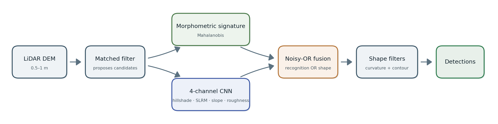
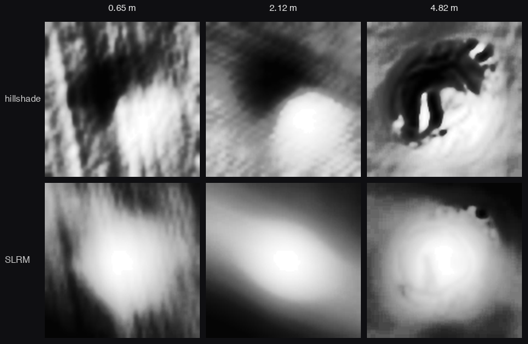
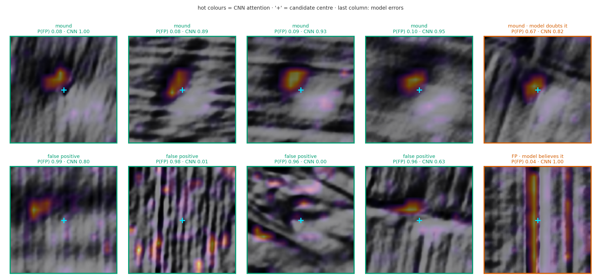
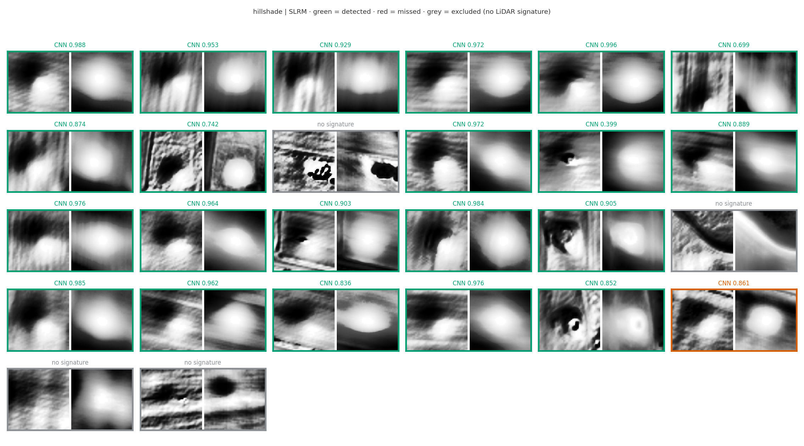
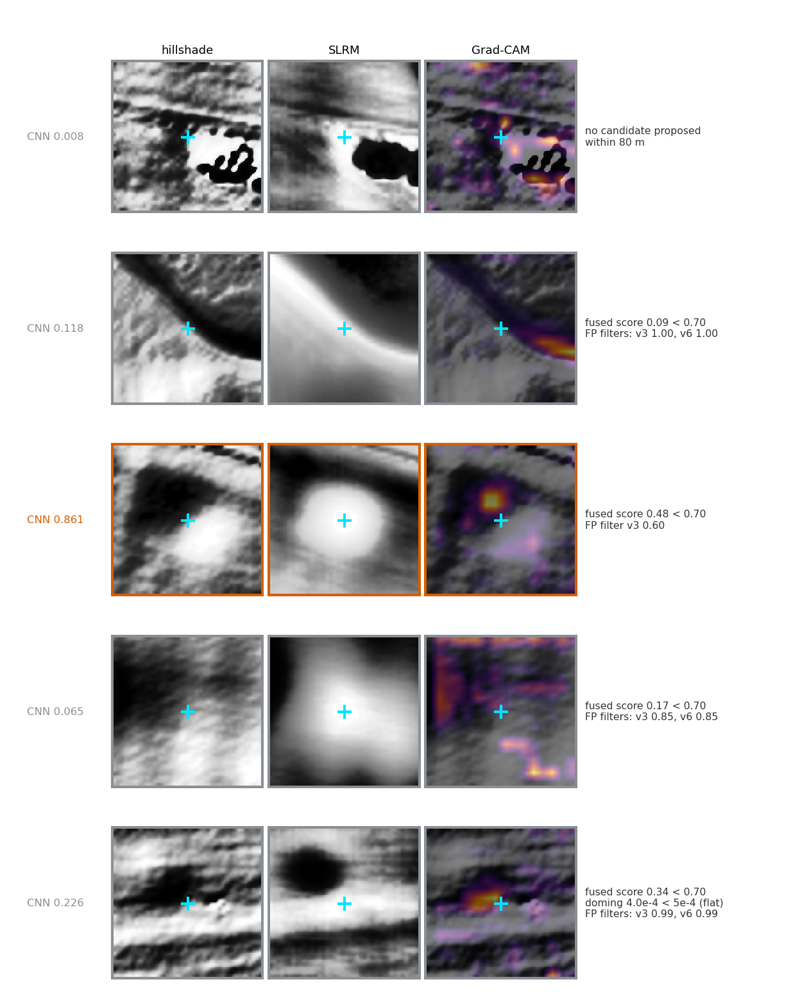
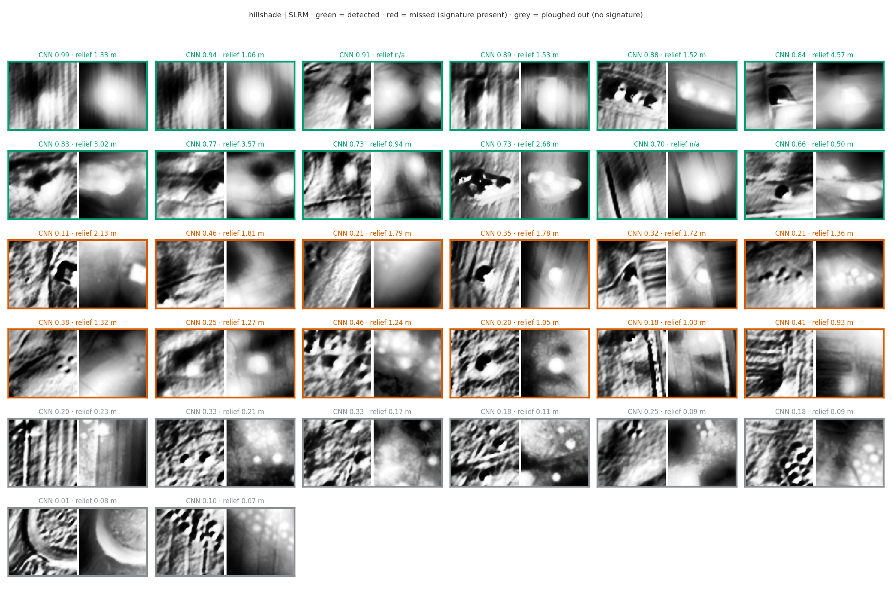

# Detecting plain-field burial mounds in LiDAR via cross-country morphology transfer

Andrei Chiper-Leferman

## Abstract

We present a detector of burial mounds (kurgans) in LiDAR for the plains of Romania, where centuries
of ploughing have flattened many mounds and official catalogues are incomplete. The central data idea
is **morphology transfer**: the network learns dome shape from Danish mounds, while the
counter-examples come from Romanian terrain. The core is a small CNN (~23,000 parameters), embedded in
a chain that fuses visual recognition with morphometry and with curvature filters. It recovers 31% of
48 unseen tumuli from the official register (50% of those with visible relief) and transfers only
partially to foreign kurgans. Its role is prospection on 0.5 m LiDAR; confirmation remains field survey.

## 1. Problem

Kurgans are round mounds on open terrain. Ploughing has often brought them below 1 m in height at tens
of meters in diameter, so the target includes scarified mounds, not only clear domes. Official
catalogues are incomplete and poorly georeferenced, so they cannot serve as a precision reference.
Automated mound detection in LiDAR already has a consistent literature — geomorphometry, marked point
processes and convolutional networks (including on kurgans).

## 2. Data and cross-country transfer

Visible Romanian positives are few. The solution: borrow the shape where mounds survive by the
thousands, and take the negatives from the working terrain; both are trained jointly.

- **Positives:** Danish mounds (*Fund og Fortidsminder*, Rundhøj, 0.4 m) plus Romanian mounds (Arad,
  Timiș, Oltenia): 1,500 + 105 for the production CNN, 21,564 + 146 for the single-channel core.
- **Negatives:** mostly Romanian (plain, hills, villages, ploughland, dikes), plus mimics from the
  model's own false positives: ~10,800 (production CNN), ~52,000 (core).

Each source contributes both positives and negatives, so source identity cannot become a shortcut.
The benefit of the Danish positives is not yet demonstrated (one ablation run, within run-to-run
noise). Declared risk: the class imbalance is the biggest danger for Romanian specificity.

## 3. Model

A small CNN (~23k parameters), 128×128 px input windows covering 80 m of terrain at 2 m effective
resolution (multidirectional hillshade; the production CNN adds SLRM, slope, roughness):

```
Conv2d(→16,3×3,s2)→ReLU → Conv2d(→32)→ReLU → Conv2d(→64)→ReLU → AdaptiveAvgPool → Linear(64→1)
```

Small by design: a large network would memorize the source, not the shape. By construction, the
positive class is dome symmetry, not prominence, so it also fires on scarified mounds.



The production chain (Figure 1): a matched filter proposes candidates; two independent lines of
evidence — the morphometric signature (Mahalanobis distance on shape descriptors) and the 4-channel
CNN (hillshade, SLRM, slope, roughness) — are fused noisy-OR into one score with one threshold
(a candidate passes if it *looks like* OR *has the geometry of* a mound; the fusion has AUROC 0.92
in cross-validation on the fitting set, not blind); curvature and contour filters then cut the mimics.

## 4. Detection on flattened mounds



**Figure 2.** Three mounds accepted on visual review (0.65 / 2.12 / 4.82 m): the diameter stays ~32 m
while the height nearly vanishes, so the detector works on shape, not amplitude.

## 5. Discriminating mimics

Mimics (natural undulations, spoil heaps, dikes, ploughland) match the mound both in shape and in
setting. Two choices address them: the recognition + morphometry fusion (each catches what the other
misses), and curvature as a filter after the network (Grad-CAM showed the network confuses linear
banks with domes; curvature was noise inside the network, but signal as a filter).

Measured on 541 mimics and 635 visually reviewed mound candidates: no single signal dominates, but combined they give AUC 0.94 (0.85 on a held-out set); the strongest are contour
linearity and circularity. The inspiration came from the ABCD criteria of dermatoscopy. Curvature as a
fifth input channel helps in other work; here it was noise, so we use it as a filter, not as an input.



## 6. Evaluation

### 6.1 Official register (independent test)

48 eISM tumuli (Dolj, Olt) in the 0.5 m coverage, none used as training positives. Detection within
50 m:

| Subset | Recovered |
|---|---|
| All | **15/48 = 31%** (95% CI 20–45%) |
| Visible relief (SLRM peak ≥ 0.3 m) | 13/26 = 50% |
| No visible relief | 2/22 = 9% |

The register is incomplete (50 tumuli in Dolj), so it measures recall, not precision.

### 6.2 Catane (development area)

Full scan at real prevalence, ~57 km². Not a blind test: 21 of the 26 labels were found by earlier
model versions, and the model, thresholds and filters were tuned here. Four labels without LiDAR
signature were excluded after the run (all among the misses).

| Labels | Model | AUPRC | recall @0.7 | FP @0.7 |
|---|---|---|---|---|
| All 26 | Production chain | 0.56 | 20/26 | 19 |
| 22 kept | Production chain | 0.66 | 20/22 | 19 |
| 22 kept | Single-channel core (trained on 13 of them) | 0.68 | 16/22 | 6 |
| 22 kept | Single-channel core retrained without Catane (2 runs) | 0.16 · 0.28 | 17/22 · 5/22 | 275 · 13 |

Removing Catane from training cuts the core's AUPRC from 0.68 to 0.16–0.28. At the operating point: 21/26
labels (81%), plus 19 detections outside the labels (Figure 4).



**Figure 4.** Catane labels at the operating point: 21 detected (green), 1 missed (red), 4 excluded (grey).



**Figure 4b.** Grad-CAM on the 4 excluded no-signature labels and on the one faint real mound missed,
with the reason for each cut.

## 7. Generalization to foreign mounds

The production CNN on foreign mounds (public LiDAR, OSM catalogues; AUROC with 95% CI, recall at 0.5):

| Set | Morphology | Resolution | AUROC | recall |
|---|---|---|---|---|
| UK, Salisbury Plain | ditch-ring barrows | 1 m | 0.644 (0.55–0.74) | 10/60 = 17% |
| NL, Veluwe/Drenthe | domes under forest | 0.5 m | 0.617 (0.51–0.72) | 8/59 = 14% |
| PL, kurgans | domes on open fields | 1 m | 0.709 (0.61–0.81) | 16/60 = 27% |

The full chain (with the filters) keeps only 6/55 Polish kurgans (11%), with 1/49 false alarms. Transfer is
partial and the intervals overlap. Clear kurgans score like home mounds (0.89–0.99); where
the relief is still visible (≥ 0.35 m), 14/32 Polish kurgans are recognized. Other morphologies require
local data.



**Figure 5.** Green = detected; red = missed despite a LiDAR signature (a real failure); grey = no
signature (ploughed-out kurgan). CNN = recognition score; relief = the signature at the point.

## 8. Limitations

- Recall on the official register: 31% (50% with visible relief) — a prospection aid, not an inventory.
- No blind test yet: Catane is a development area.
- Benefit of the Danish positives not yet demonstrated.
- Very small mounds (<~15 m) are under-detected; precision collapses at ≥2–5 m resolution.
- Near-perfect mimics remain false positives; topographic openness, spatial priors and multispectral
  data do not separate them.
- Class imbalance (Danish vs Romanian).
- Filters calibrated for plains; they require recalibration for hills or another country.
- Catalogue-based precision is not yet a number: it requires a second blind evaluator.

## 9. Reproducibility and next steps

Code in this repository. Test LiDAR: Environment Agency (UK), PDOK AHN (NL), GUGiK (PL). Next steps:
(1) a blind test on a new area, labelled before scanning; (2) field survey of a sample of candidates;
(3) a second blind evaluator; (4) a head-to-head benchmark against the best kurgan method in the
literature, if Hungarian LiDAR can be obtained; (5) small-mound positives and more Romanian positives.

## Acknowledgements

Special thanks to **Dr. Alexandru Hegyi** and **Dr. Mehdi Nourelahi** for their guidance and advice.

## 10. References

- Hesse, R. (2010). LiDAR-derived Local Relief Models – a new tool for archaeological prospection. *Archaeological Prospection* 17(2):67–72. doi:10.1002/arp.374
- Mahalanobis, P.C. (1936). On the generalised distance in statistics. *Proceedings of the National Institute of Sciences of India* 2(1):49–55.
- Nachbar, F., Stolz, W., Merkle, T., et al. (1994). The ABCD rule of dermatoscopy. High prospective value in the diagnosis of doubtful melanocytic skin lesions. *Journal of the American Academy of Dermatology* 30(4):551–559. doi:10.1016/S0190-9622(94)70061-3
- Niculiță, M. (2020). Geomorphometric Methods for Burial Mound Recognition and Extraction from High-Resolution LiDAR DEMs. *Sensors* 20(4):1192. doi:10.3390/s20041192
- Selvaraju, R.R., Cogswell, M., Das, A., et al. (2017). Grad-CAM: Visual Explanations from Deep Networks via Gradient-Based Localization. *Proc. IEEE International Conference on Computer Vision (ICCV)*:618–626.
- Yang, H. (2025). Segmenting ancient cemeteries under forests using synthesized LiDAR-derived data and deep convolutional neural network. *npj Heritage Science*. doi:10.1038/s40494-025-01798-5

---

*Tools and experiments: AI coding agent, under the author's direction and verification.*
